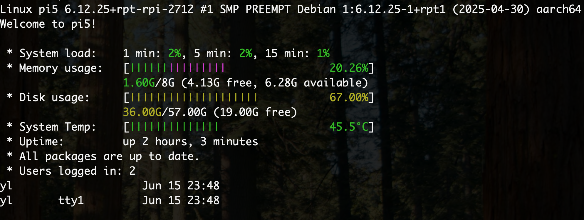

Copy the `/etc/update-motd.d` folder content into the same directory on Pi and you'll get a nice login message (Message Of The Day) like this:

The order of the message relies on the numeric part of the filename, smaller numbers will show up first.
